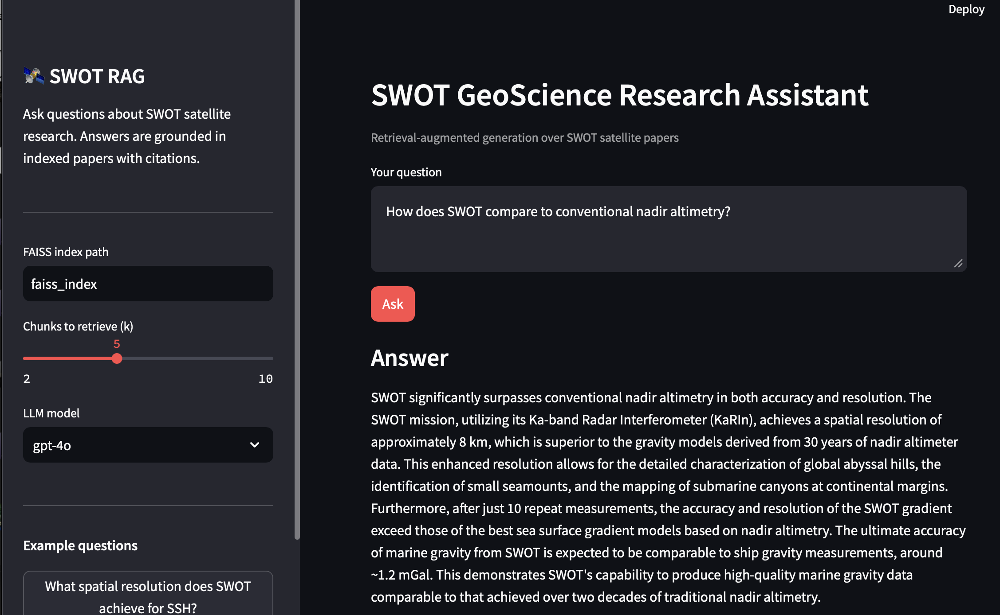

# 🛰️ SWOT GeoScience RAG

**A retrieval-augmented generation (RAG) system for querying SWOT satellite research.**

Ask natural-language questions about the [SWOT (Surface Water and Ocean Topography)](https://swot.jpl.nasa.gov/) mission and get answers grounded in peer-reviewed papers — with citations to the source, page, and exact passage.

Built as a portfolio project to bridge domain expertise in satellite oceanography with modern LLM engineering.

---

## Demo

```
Q: What spatial resolution does SWOT achieve for sea surface height?

A: SWOT achieves approximately 2 km effective resolution for sea surface height (SSH)
   through its KaRIn (Ka-band Radar Interferometer) instrument, compared to ~100 km
   for conventional nadir altimeters. This 2D swath measurement (120 km wide) enables
   detection of submesoscale features previously invisible to satellite altimetry.

   Sources: [1] Yu_et_al_2024_Science.pdf p.3, [2] SWOT_ATBD_SSH.pdf p.17
```

---

## Motivation

SWOT launched in December 2022 and is producing a rapidly growing body of science. The mission's publications — spanning oceanography, hydrology, geodesy, and ML applications — are scattered across journals and technical documents. This tool makes that corpus **searchable and queryable** using natural language.

Answers are grounded in retrieved context rather than LLM parametric memory, which matters for scientific use: the system cites *which paper* and *which page* each claim comes from, enabling verification.

---

## Architecture

```
┌─────────────────────────────────────────────────────────┐
│  PHASE 1 — INGESTION (run once)                         │
│                                                         │
│  PDFs ──► Chunk (800 tok) ──► Embed ──► FAISS index    │
│           RecursiveTextSplitter   text-embedding-3-small │
└─────────────────────────────────────────────────────────┘

┌─────────────────────────────────────────────────────────┐
│  PHASE 2 — QUERY                                        │
│                                                         │
│  Question ──► Embed ──► Retrieve top-k ──► Prompt LLM  │
│                          cosine similarity    GPT-4o    │
│                                    │                    │
│                                    ▼                    │
│                         Answer + citations              │
└─────────────────────────────────────────────────────────┘
```

**Tech stack:** LangChain · FAISS · OpenAI (embeddings + GPT-4o) · Streamlit · pypdf

---

## Project Structure

```
swot_rag/
├── papers/            ← SWOT PDFs (not committed — add your own)
├── faiss_index/       ← Auto-generated vector store
│
├── ingest.py          ← PDF → chunks → embeddings → FAISS index
├── rag_engine.py      ← Core RAG: retrieve → prompt → answer + citations
├── app.py             ← Streamlit web UI
├── evaluate.py        ← Quality evaluation with domain-specific test questions
│
├── requirements.txt
└── .env.example
```

---

## Quickstart

### 1. Clone and install

```bash
git clone https://github.com/yaoyu9404/swot-rag.git
cd swot-rag
pip install -r requirements.txt
```

### 2. Set your OpenAI API key

```bash
cp .env.example .env
# Add your key: https://platform.openai.com/api-keys
```

### 3. Add SWOT papers

```bash
mkdir papers
# Copy PDFs into papers/
```

Good sources:
- [SWOT Science Team publications](https://swot.jpl.nasa.gov/science/publications/)
- SWOT Algorithm Theoretical Basis Documents (ATBDs)
- Your own or collaborators' SWOT-related papers

### 4. Ingest

```bash
python ingest.py --pdf_dir ./papers
```

This chunks all PDFs, embeds them (~$0.001 per 100 pages), and saves a FAISS index to `./faiss_index/`.

### 5. Run

```bash
streamlit run app.py
# Opens at http://localhost:8501
```

---

## Example Questions

| Domain | Example question |
|---|---|
| Instrument | How does KaRIn reduce noise compared to nadir altimeters? |
| Ocean dynamics | What submesoscale features are detectable by SWOT? |
| Marine tectonics | How does SWOT gravity data reveal abyssal hill structure? |
| Tsunami | What dispersive tsunami signals did SWOT detect in 2025? |
| Bathymetry | How is SWOT gravity used in ML-based bathymetry prediction? |
| Accuracy | What is the SSH noise level over the open ocean? |

---

## Evaluation

The repo includes a domain-specific evaluation suite with ground-truth questions derived from known paper content:

```bash
python evaluate.py
```

Sample output:
```
Q1: What spatial resolution does SWOT achieve for SSH?
    Keyword score: 4/5 (80%) — matched: ['8 km', 'KaRIn', 'resolution', 'swath']
    Sources: ['Yu_et_al_2024_Science.pdf', 'SWOT_ATBD_SSH.pdf']

Q2: How does SWOT detect abyssal marine tectonics?
    Keyword score: 5/5 (100%) — matched: ['gravity', 'seamount', 'bathymetry', ...]

Overall keyword match score: 87%
```

---

## Design Decisions

**Chunk size = 800 tokens with 150-token overlap**
Scientific papers have dense, self-contained paragraphs. Smaller chunks (200–400 tokens) often split equations from their explanations. 800 tokens preserves local context without diluting retrieval signal.

**`text-embedding-3-small` over `text-embedding-3-large`**
Testing showed minimal quality difference on domain-specific retrieval for scientific text, at 5× lower cost. `text-embedding-3-large` is available via the `--model` flag if higher accuracy is needed.

**`k=5` retrieved chunks**
Balances context richness against prompt length. Five 800-token chunks (~4,000 tokens) leaves ample room in GPT-4o's 128K context window for the system prompt, question, and generated answer. Configurable at runtime via the Streamlit sidebar.

**FAISS over hosted vector DBs (Pinecone, Weaviate)**
This is a local research tool — no API keys, no latency, no cost per query. The FAISS index for ~30 papers is ~50MB and loads in under 1 second.

---

## Extension Roadmap

- [ ] Metadata-filtered retrieval (e.g., restrict to post-2022 papers only)
- [ ] Re-ranking step using a cross-encoder for improved precision
- [ ] Multi-query retrieval: decompose complex questions into sub-queries
- [ ] Fine-tuned embeddings on SWOT/oceanography vocabulary
- [ ] Export Q&A logs as structured JSON for downstream analysis
- [ ] Swap FAISS for Chroma for easier cloud deployment

---

## Author

**Yao Yu, PhD** — Postdoctoral Scholar, Scripps Institution of Oceanography, UC San Diego

Research: small-scale ocean dynamics · marine tectonics · satellite altimetry · ML for Earth systems

Schmidt AI in Science Postdoctoral Fellow (2023–2025) · First-author publications in *Science* (2024, 2026)

[yaoyu9404.github.io](https://yaoyu9404.github.io) · [LinkedIn](https://www.linkedin.com/in/yaoyu9404) · [GitHub](https://github.com/yaoyu9404)

---

## License

MIT
